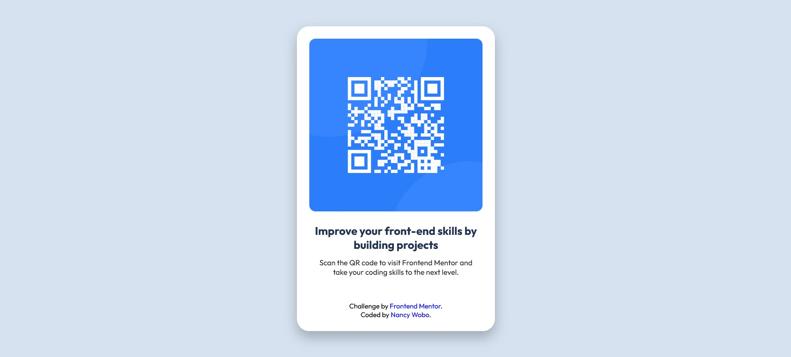

# QR Code Challenge

A perfect first challenge if you're new to HTML and CSS.

## Table of contents

- [Overview](#overview)
  - [Screenshot](#screenshot)
  - [Links](#links)
- [My process](#my-process)
  - [Built with](#built-with)
  - [Useful resources](#useful-resources)
- [Author](#author)

**Note: Delete this note and update the table of contents based on what sections you keep.**

## Overview

The challenge involves creating a front-end component featuring a QR code card. This card is a part of a front-end development exercise aimed at improving coding skills through practical projects. The component is styled according to a given design specification, focusing on layout, color scheme, typography, and responsiveness.

The layout requires the component to be centered on the page with a particular emphasis on mobile (375px) and desktop (1440px) views. The color scheme is defined with HSL values, providing a crisp and clean aesthetic with shades of blue and gray. The typography utilizes the 'Outfit' font family with specified weights for different text elements.

A key aspect of the challenge is to ensure that all text within the component is appropriately styled and aligned. Special attention is needed to center the second line of text within a paragraph, which describes the action users should take — scanning the QR code to enhance their coding skills via Frontend Mentor.

This challenge serves as an excellent way for new developers to get hands-on experience with HTML and CSS, particularly in creating responsive layouts and styling elements to match a design brief. It's a practical task that combines fundamental front-end techniques with a focus on aesthetic details and user instructions.

### Screenshot

Below is a screenshot of the finished looked.

### Links

- Solution URL: [Add solution URL here](https://your-solution-url.com)
- Live Site URL: [Add live site URL here](https://your-live-site-url.com)

## My process

### Built with

- Semantic HTML5 markup
- CSS custom properties
- Flexbox
- CSS Grid

## Author

- Website - [Add your name here](https://www.your-site.com)
- Frontend Mentor - [@yourusername](https://www.frontendmentor.io/profile/yourusername)
- Twitter - [@yourusername](https://www.twitter.com/yourusername)

**Note: Delete this note and add/remove/edit lines above based on what links you'd like to share.**
